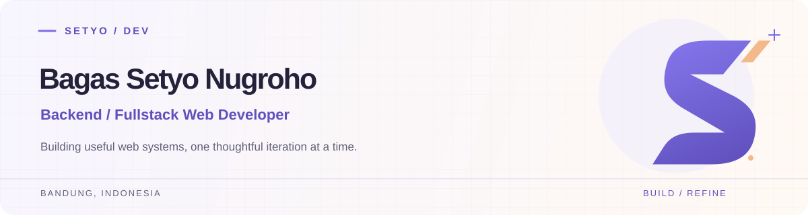

  

# Hi, I'm Bagas.

I'm a backend and fullstack web developer based in Bandung, Indonesia. I enjoy turning complex workflows into web apps that feel simple to use and straightforward to maintain. Most of my work has been on government platforms, enterprise applications, and internal business systems.

**Currently:** building with Laravel and working across the stack when the project calls for it. Open to backend and fullstack opportunities.

## Selected work

| Project | What I worked on | Stack |
| --- | --- | --- |
| APPWARD | Backend development and maintenance for a business application | Laravel, PHP, MySQL |
| Portal Hubla | Fullstack development for a maritime portal | .NET, Angular |
| Citizenship application | Migrated an existing Yii2 application | NestJS, Next.js |
| DPD RI portal | Interface implementation and API integration | Tailwind CSS, Alpine.js, .NET Core |

Some of this work belongs to clients and does not have a public repository. I can talk through my contribution and technical decisions in a conversation.

## Tools I use

| Area | Technologies |
| --- | --- |
| Languages | PHP, JavaScript, Go |
| Backend | Laravel, Yii2, .NET, Express.js, NestJS |
| Frontend | React, Next.js, Vue, Nuxt.js, Angular, Tailwind CSS, Alpine.js |
| Data and tooling | MySQL, PostgreSQL, SQLite, Git, Docker, MinIO |

## How I work

**Understand** the problem &rarr; **Analyze** the constraints &rarr; **Design** an approach &rarr; **Build** the solution &rarr; **Refine** what needs improvement.

I'm studying Informatics Engineering at Universitas Sangga Buana alongside full-time work, with graduation scheduled for October 2026.

## Get in touch

[Email](mailto:bagazfrazetyo@gmail.com) · [LinkedIn](https://www.linkedin.com/in/bagas-setyo)
