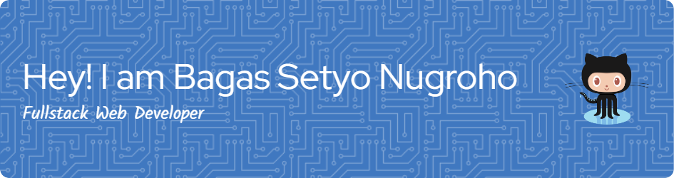

# 👋 Hi there! I'm Bagas Setyo Nugroho

I'm **Bagas Setyo Nugroho**, a passionate **Web Developer** with over **4 years of experience**, specializing in **PHP (Laravel)** and modern web technologies. I enjoy building clean, maintainable, and scalable web applications that solve real-world problems.

---

## 🚀 Tech Stack

### 🧠 Main Stack (Advanced)

### ⚙️ Intermediate

### 🧪 Learning / Beginner

---

## 🎓 Education

- **SMK N 2 Magelang** – Software Engineering (Graduated 2021)
- **Universitas Sangga Buana** – Currently studying (not yet completed)

---

## 📫 Let's Connect

---

